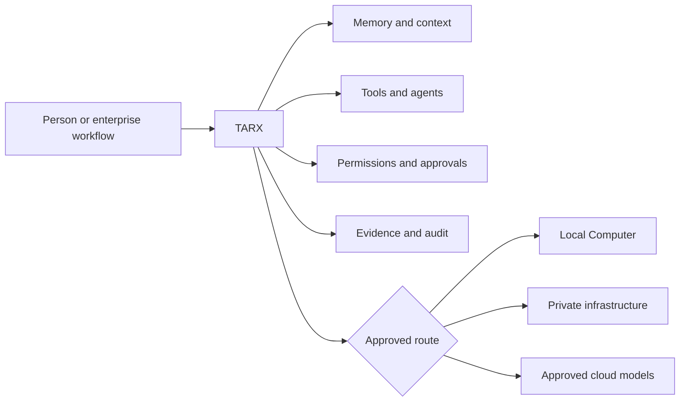

# TARX

### Private AI with memory, tools, permissions, and evidence

TARX is a governed runtime for personal and enterprise AI. It gives models and
agents the operating layer they are missing: persistent context, private
memory, approved capabilities, model routing, human approval, and evidence of
what happened.

**Computer by default. Supercomputer by permission.**

[Website](https://tarx.com) ·
[Download the Mac beta](https://tarx.com/download) ·
[Documentation](https://docs.tarx.com) ·
[Public releases](https://github.com/tarx-ai/tarx-desktop/releases)

## One runtime contract, multiple execution paths

TARX is not a model company or a chatbot wrapper. It is the governed layer
around inference and action, designed so a user or organization can control
where work runs, what an agent may do, and what proof it must return.

## Public proof

| Repository | What you can inspect |
| --- | --- |
| [`tarx-desktop`](https://github.com/tarx-ai/tarx-desktop) | Signed and notarized Apple Silicon beta, hardened Electron shell, release verification, security boundaries, and QA evidence |
| [`tarx-cli`](https://github.com/tarx-ai/tarx-cli) | Portable local runtime control, diagnostics, model services, semantic search, project spaces, and MCP client setup |

The current public surface demonstrates:

- Local inference and embeddings
- A desktop bridge into the governed TARX runtime
- MCP connections for major AI development clients
- Proposal-first actions and explicit approval boundaries
- Health, system-integrity, release, and security documentation

## Build with us

The best public contributions improve the developer boundary: compatibility,
diagnostics, release trust, MCP interoperability, documentation, and
reproducible tests. Proprietary orchestration, internal operations, production
infrastructure, customer data, and model weights remain private.

Start with the [TARX CLI](https://github.com/tarx-ai/tarx-cli) or install the
[TARX Desktop beta](https://tarx.com/download).

## Company and founder

TARX is built by **TARXAN Inc**, founded by
[John Wantz Jr.](https://github.com/wantzjt), an AI systems architect and
product leader focused on governed agents, local-first AI, enterprise search,
evaluation, and human-centered AI systems.

[Founder profile](https://github.com/wantzjt) ·
[Portfolio](https://www.johnwantz.com/portfolio) ·
[LinkedIn](https://www.linkedin.com/in/johntwantz/)
